# 📚 Library Management System (KivyMD)

> A KivyMD-based modern UI library app to help readers find, borrow, and explore books. Powered by OTP login and machine learning recommendations.

## 🚀 Features
- 🔐 OTP Login (WhatsApp via pywhatkit)
- 📘 Check Book Availability, ISBN, and Shelf Location
- 🔁 Borrow / Return / Renew Books and Pay Late Fines
- 🧠 Book Recommendations using Scikit-learn + NLP
- 💡 Personalized Book Recommendations
- 📊 Track User Reading History
- 🎨 KivyMD UI with custom fonts & images
- 📦 Secure user profile handling

## 🛠️ Technologies Used
- Python
- Kivy
- KivyMD
- WhatsApp OTP (via `pywhatkit`)
- CSV for book/user data
- Custom `.kv` layout files

## 📁 Project Structure

📂Library-Management-System/

├── LMS.py

├── kv/

├── assets/

├── fonts/

├── data/Books.csv

├── requirements.txt

├── README.md

└── .gitignore

## 📸 App Screenshots

All screenshots are organized by flow. Below are visual previews of each feature in the app.

---

### 🔐 1. Sign In / Sign Up Flow
- 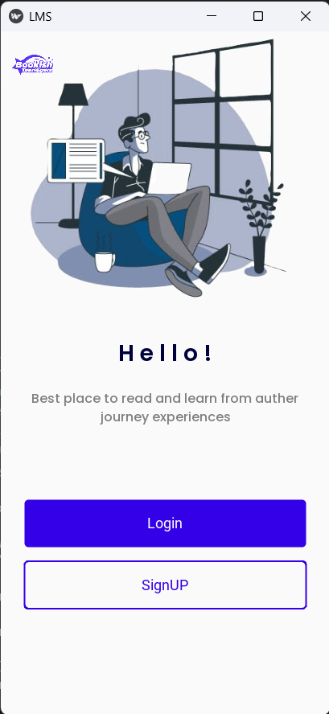
- .png)
- .png)

---

### 🏠 2. Home, Profile & Navigation
- 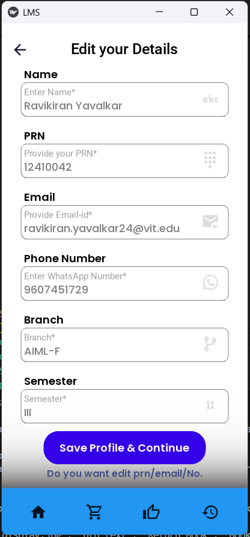
- 
- .png)
- .png)

---

### 📍 3. Book Location
- 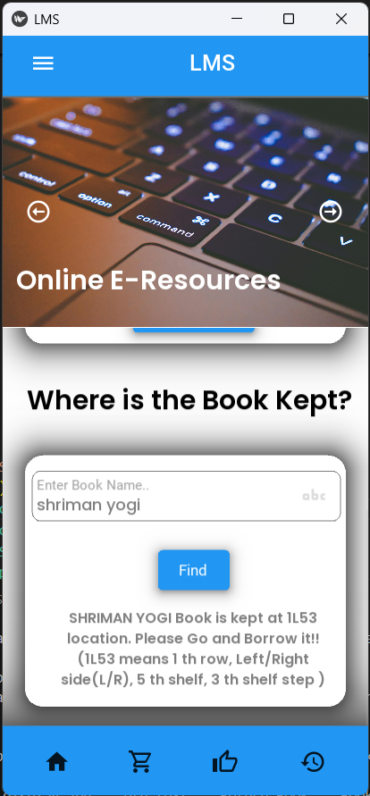

---

### 🔍 4. Search Feature
- 
- 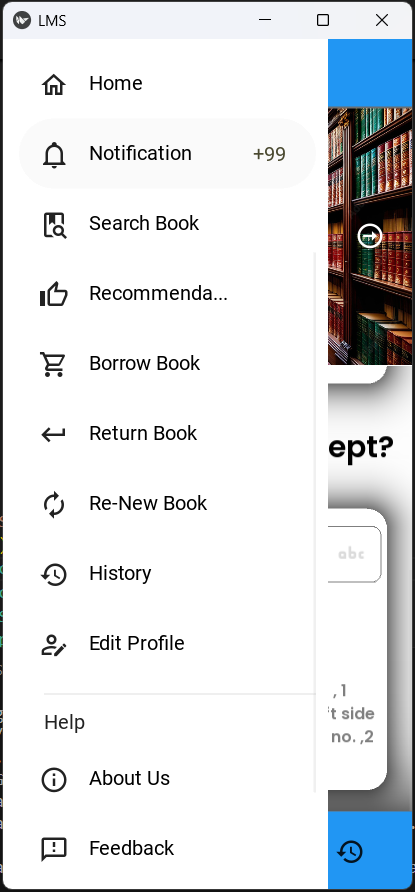
- 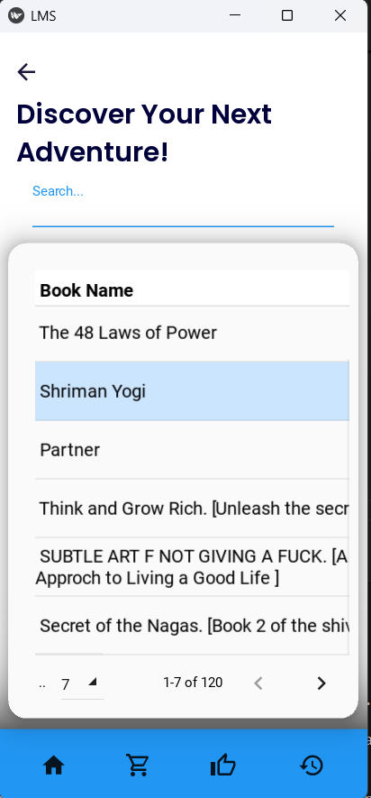
- 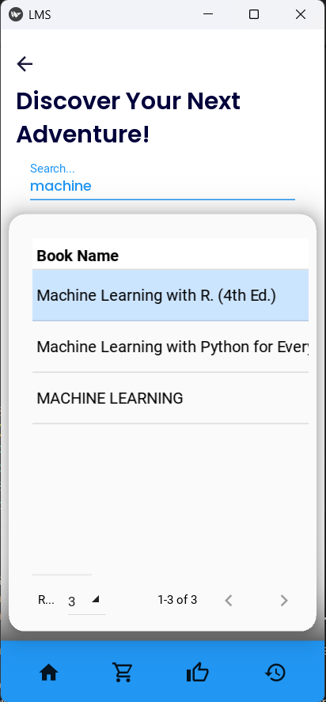

---

### 🤖 5. Book Recommendation
- 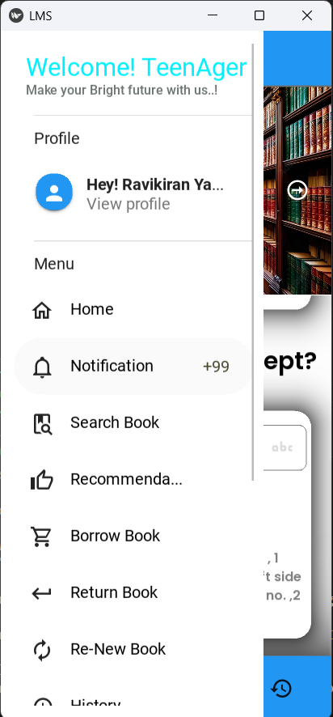
- 
- 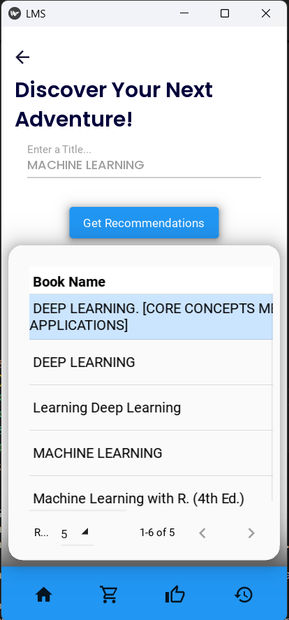

---

### 📚 6. Borrow Book Flow
- 
- 
- 
- 
- 
- 
- .png)
- .png)

---

### ✅ 7. Return Books
- 
- 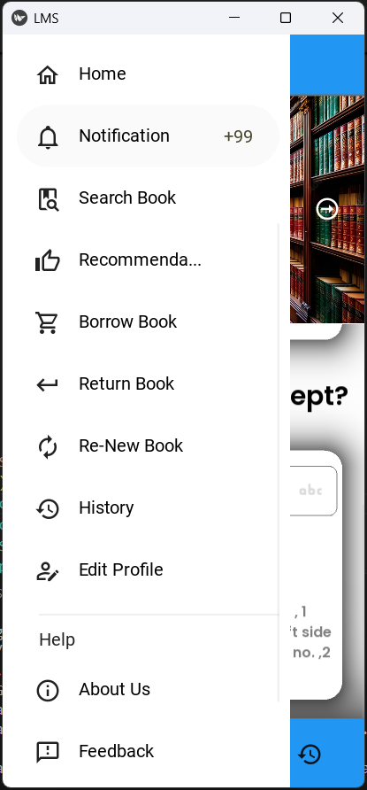
- 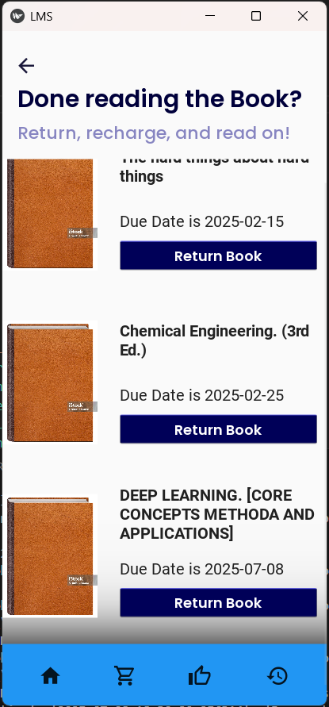

---

### ♻️ 8. Renew Books
- 
- 
- 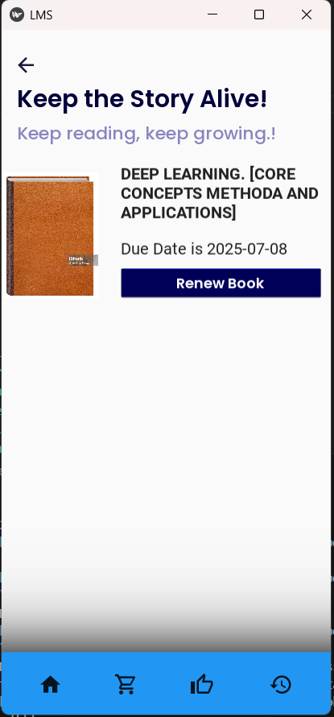

---

### 📈 9. Reading History
- 
- 
- 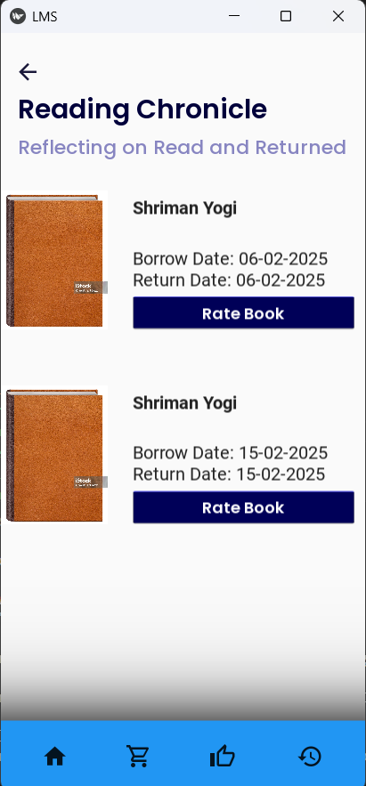

## ▶️ How to Run
```bash
pip install -r requirements.txt
python LMS.py
